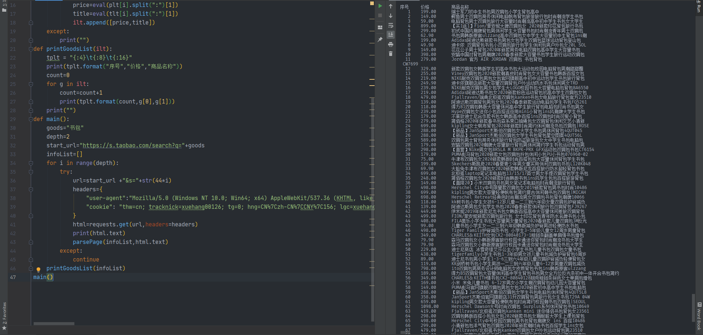

需要登录后真实的cookie，如果不是登录都的cookie信息，会直接访问到登录页面，请注意。

因为源代码不能正常访问只是提供一种参考，如果还有更好的方法可以给我留言分享给大家，另外注意保护好个人的cookie信息。

视频教程地址：https://v.qq.com/x/page/f0951sww5ms.html

```python
import requests
import re
def getHTMLText(url):
    try:
        r=requests.get(url,timeout=30)
        r.raise_for_status()
        r.encoding=r.apparent_encoding
        return r.text
    except:
        return ""
def parsePage(ilt,html):
    try:
        plt=re.findall(r'\"view_price\"\:\"[\d\.]*\"',html)
        tlt=re.findall(r'\"raw_title\"\:\".*?\"',html)
        for i in range(len(plt)):
            price=eval(plt[i].split(":")[1])
            title=eval(tlt[i].split(":")[1])
            ilt.append([price,title])
    except:
        print("")
def printGoodsList(ilt):
    tplt = "{:4}\t{:8}\t{:16}"
    print(tplt.format("序号","价格","商品名称"))
    count=0
    for g in ilt:
        count=count+1
        print(tplt.format(count,g[0],g[1]))
    print("")
def main():
    goods="书包"
    depth=2
    start_url="http://s.taobao.com/search?q="+goods
    infoList=[]
    for i in range(depth):
        try:
            url=start_url +"&s="+str(44*i)
            headers={
                "user-agent":"Mozilla/5.0 (Windows NT 10.0; Win64; x64) AppleWebKit/537.36 (KHTML, like Gecko) Chrome/80.0.3987.149 Safari/537.36",
                "cookie": "自己浏览器的信息"
            }
            html=requests.get(url,headers=headers)
            print(html.text)
            parsePage(infoList,html.text)
        except:
            continue
    printGoodsList(infoList)
main()


```




