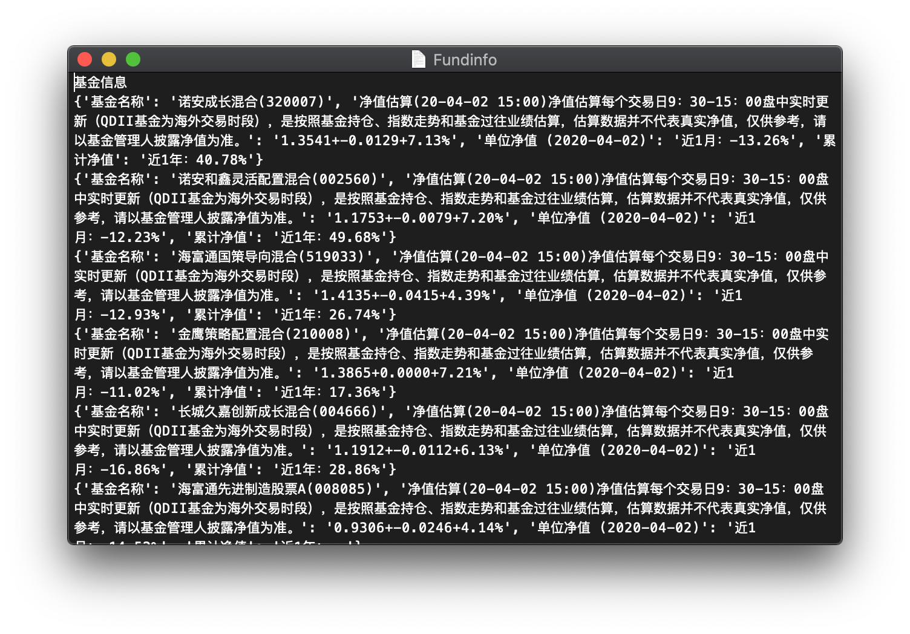

```python

关于使用“基金价格及相关信息”爬取，代替原有实战案例的建议
在进行股票价格及相关信息爬去的过程中，我发现爬取的网站出现了不能访问或者改用了JS语言而当前所学不能爬取的的情况，建议老师在讨论区内推荐大家使用“基金价格及相关信息”的爬取来让同学们进行实战训练。在嵩老师的代码基础上，我做了一些修改，修改代码附在了最后，然后后面还有原理的讲解。

代码见最后。

首先输入https://fund.eastmoney.com/robots.txt 

查看爬取限制：

User-agent: * 
Disallow: /*spm=*
Disallow: /*aladin

发现如上限制

但是我们进行模拟人的信息搜集不影响我们爬取。

访问天天基金网，然后找到基金列表，查看源代码可以发现，基金编码被封装在了tr标签内的id属性下，以tr开头接上6位数字，之后可以继续找到基金详细信息的界面，然后查看源代码，发现基金的有关信息都被封装在了merchandiseDetial里面，其中fundDetail-tit属性封装了基金名称，而dd、dt标签下也封装了相关的基金价格和估值变化等信息可以进行爬取。

爬取结果如图 后续还需要进一步的清洗，但是希望及时分享给需要的同学进行学习。


```

```python

import requests
from bs4 import BeautifulSoup
import traceback
import re
 
def getHTMLText(url):
    try:
        r = requests.get(url)
        r.raise_for_status()
        r.encoding = r.apparent_encoding
        return r.text
    except:
        return " "
 
 
def getFundList(lst, fundURL):
    html = getHTMLText(fundURL)
    soup = BeautifulSoup(html, 'html.parser')
    a = soup.find_all('tr')
    for i in a:
        try:
            id = i.attrs['id']
            lst.append(re.findall(r"[tr]\d{6}", id)[0])
        except:
            continue
 
def getFundInofo(lst, fundURL, fpath):
    for fund in lst:
        url = fundURL + fund[1:] + ".html"
        html = getHTMLText(url)
        try:
            if html == '':
                continue
            infoDict = {}
            soup = BeautifulSoup(html, 'html.parser')
            fundInfo = soup.find('div', attrs={'class': "merchandiseDetail"})
            name = fundInfo.find_all(attrs={'class': "fundDetail-tit"})[0]
            infoDict.update({'基金名称': name.text.split()[0]})
 
            keyList = fundInfo.find_all("dt")
            valueList = fundInfo.find_all("dd")
            for i in range(len(keyList)):
                key = keyList[i].text
                val = valueList[i].text
                infoDict[key] = val
 
            with open(fpath, 'a', encoding='utf-8') as f:
                f.write(str(infoDict) + '\n')
        except:
            traceback.print_exc() #获得错误信息
            continue
 
def main():
    fund_list_url = "https://fund.eastmoney.com/fund.html#os_0;isall_0;ft_;pt_1"
    fund_info_url = "https://fund.eastmoney.com/"
    output_file = 'D://Fundinfo.txt'
    slist = []
    getFundList(slist, fund_list_url)
    getFundInofo(slist, fund_info_url, output_file)
 
main()


```

